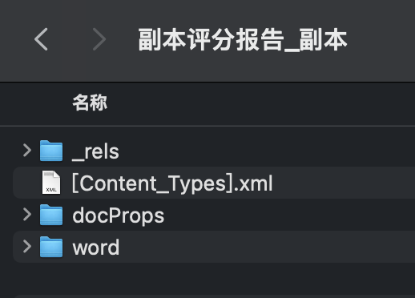

# 用node帮女朋友生成报告单

## 背景

女朋友是医学生， 平时需要在医院里实习。最近老师给了她一个任务：从一个调查问卷里导出结果表（一个excel文件），并且把每个人的结果填写到特定的一个模版报告单。

但是这个结果有几百个人（意味着要复制黏贴上千次），重复无意义且繁琐的工作，严重影响了与男朋友聊天的时间。

身为男朋友的我怎能袖手旁观，重复工作就应该交给机器！

花费了大概一个下午的时间，完成了一个node小脚本，我女朋友只需要编辑好模版插值的位置，导入结果excel，每个人的结果文件就会在数秒内自动生成，已完成交付。

## 需求点

- 表格的识别
- word模板的识别
- 特定列的结果要加以计算判断并输出最终医嘱
- 文件名称要根据每个人的名字生成

## 分析

### 表格的解析

使用`exceljs`这个库进行excel的解析。这个库挺强大，可以读取、操作并写入数据和样式到xlsx文件，号称一个一个 Excel 电子表格文件逆向工程项目。

### 模板word文件的识别

这里文件的识别说难也不难，快速调研之后发现，其实Word文件基本都遵循一个标准进行存储：`Microsoft Office Open XML标准`，

这个标准是用于描述和存储电子文档，由`Ecma International`（欧洲计算机制造商协会）管理和维护的

而XML和HTML一样都是常用的标记语言，XML更多用于数据交换。

而docx文件其实本质上就是一个压缩包，只要把后缀改成zip并解压缩，就可以看到这些文件



其中`word/document.xml`中存放了该docx文档的具体内容，我们只要修改这一部分，最终再写回成`zip`文件并改扩展名为`docx`，即可实现根据模版文件输出对应例子。

## 流程

搞定了以上问题，就可以开始编写代码了，代码的工作流程如下：

1. 准备一个excel表，以及word模版
2. 将word模版中需要将数据插值的地方，填写上约定内容，用于正则匹配识别。
   1. 这里我写了%${X}%（其中X为Excel表格对应的列）
3. 读取模版excel，解析表头与内容
4. 使用admzip，把模版当作zip处理，并读取`document.xml`的内容
5. 使用正则匹配模版内容，读取所有需要插值的地方。
6. 针对excel内容的每一行，遍历：
   1. 复制一份模版文件
   2. 根据需要插值的地方，读取对应的列
   3. （可选）针对特定的列做一些计算转化，例如回答人的生日计算成年龄填入
   4. 批量替换，原地修改。
   5. 写入到目标文件夹，并将扩展名更改成`docx`
7. 结束。

## 代码

读取excel：

```javascript
const parseExcel = async () => {
  const workbook = new Exceljs.Workbook();
  // 此处省略使用inquirer命令行交互的指定文件路径录取。
  const inputFile = await workbook.xlsx.readFile(path.resolve(get__dirname(), destFile));
  const basicSheet = inputFile.getWorksheet('指定sheet');
  // 读取表内容，首行为表头
  const basicSheetContent = basicSheet.getRows(2, basicSheet.rowCount);
  return basicSheetContent;
}
```

读取模版并解析：

```javascript
const readTemplateAndParse = async () => {
  const templateZip = new AdmZip('目标文件路径');
  const templateContentXML = templateZip.readAsText("word/document.xml");
  
  const originColArr = templateContentXML.match(/%[A-Z]+%/g);
  const colArr = originColArr.map(str => str.replate(/%/g, ""));
  
  return colArr;
}
```

遍历写入：

```javascript
const generateResult = async (sheetContent, col) => {
  // 先copy一份
      await fs.copyFile(
      templateFileName,
      destFileName
    ); // 先拷贝一份，然后在这一份上作修改
  let zip;
  try {
    zip = new AdmZip(destFileName);
    
  } catch(e) {
    console.error('解析文件错误', e);
  }
  const basicSheetContent = await parseExcel();
 	basicSheetContent.forEach(async row => {
  	let contentXML: string = zip.readAsText("word/document.xml");
	  const cols = readTemplateAndParse();
  	for (let j = 0; j < cols.length; j++) {
    	const value = row.
	    // 计算属性取值过程省略
  	  contentXML = contentXML.replace(`%${cols[j]}%`, computeValue);
  	}
    try {
      await zip.addFile("word/document.xml", Buffer.from(contentXML)); // 写入
      await zip.writeZip(destFileName);
      await fs.rename(descFileName, descDocx);
    }
  })
}
```

## 问题点/卡点

### ESM+TS的选用

一开始在选择是使用esm还是cjs规范写时，选择了写的更顺手的esm规范。

但是很快就遇到一些问题

1. esm加载cjs只能整体加载，使用`import m from 'xxx.cjs'`，然后再内部解构。
2. esm加载cjs的库时也有问题。
   1. 引入构建工具，例如rollup，然后用对应插件去处理`@rollup/plugin-commonjs`

3. esm缺乏`__filename`和 `__dirname`等变量
   1. 可以使用import.meta.url重建


## 总结

仅仅是写一个脚本，为了追求快速，直接一通操作……：

1. `npm init`初始化
2. 设置package.json，`type`为`module`
3. 添加一波需要的依赖并安装：`adm-zip`、`chalk`、`dayjs`、`exceljs`、`inquirer`...
4. 上`rollup`构建工具，引入必须的插件并配置：`@rollup/plugin-typescript`、`@rollup/plugin-node-resolve`、`@rollup/plugin-commonjs`、`@rollup/plugin-json`
5. 配置`tsconfig.json`，指定`compilerOptions.module`与`compilerOptions.moduleResolution`为`NodeNext`
   1. 这里的作用为指定让ts使用什么模块规范，及使用什么路径查找方案。
6. 涉及`__dirname`与`__filename`全局变量的地方，利用`import.meta.url`替代。
7. 编码测试

## 参考资料

- [exceljs/README_zh.md at master · exceljs/exceljs (github.com)](https://github.com/exceljs/exceljs/blob/master/README_zh.md)
- [ADM 邮编 ·cthackers/adm-zip 维基 (github.com)](https://github.com/cthackers/adm-zip/wiki/ADM-ZIP)
- [前端是怎么解析Excel、PDF、Word、PPT等文件的？ - 掘金 (juejin.cn)](https://juejin.cn/post/7313048171797544997?searchId=20240411133356217F06864C2AFE0BDFA5#heading-6)
- [nodejs实现一个word文档解析器 - 掘金 (juejin.cn)](https://juejin.cn/post/6844903655989051399?searchId=2024041111055823B66E49E1ED6200D07D)


